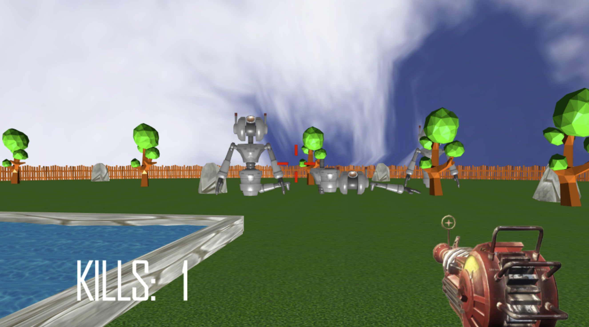

# Robot Doomsday

Robot Doomsday is a 3D WebGL game where players must survive a hoard of robots to win.
The game uses linear transformations to animate the characters and support gameplay. 

The features we included are:
* FPS Controls
* Collisions
* Robot Explosion Physics
* Robot Path Finding Algorithm (to track the player)
* Parametric Surfaces (Pond)
* Night and Day Mode
* Sounds

## Setup and Controls
To play the game - clone the repository, run the included "host.bat" or "host.command" file, then open localhost in your browser (http://localhost:8000/). Alternatively, you can play the game online, but this version tends to lag - https://neerajsamtani.github.io/robot_doomsday/

Click on the game window to begin controlling the character.
You control the player with WASD, look around with the mouse, and use the space key to fire the raygun.
You win when you kill 11 robots. If a robot gets too close, you die!

As an added feature, you can hit 'n' to switch the time of day and make the game even scarier!

## Gameplay in Robot Doomsday

___

###### The tiny-graphics.js software library was provided by UCLA Computer Science's 174A course (Intro to Computer Graphics). It implements vector mathematics and other routine operations in computer graphics to speed up our development process.
